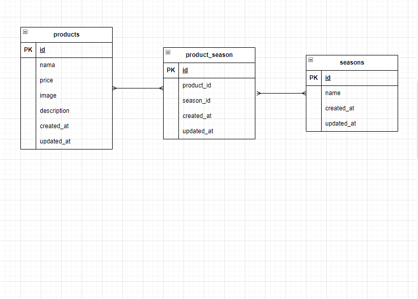

# mogitate (フリマアプリ)

「mogitate」は、テストの課題としてLaravel 8 で開発したシンプルなフリマアプリです。
季節感を取り入れた商品登録や、画像アップロード・検索・並び替えといった基本機能を実装しています。(実際に販売する機能については実装していません)

## dockerビルド

1. git clone git@github.com:tomo1583gh/check-test_mogitate.git

2. docker-compose up -d --build

*Mysqlは、OSによって起動しない場合があるのでそれぞれのPCに合わせてdocker-compose.ymlファイルを編集して下さい。

## laravel環境構築

1. docker-compose exec php bash
2. composer install
3. .env.exampleファイルから.envを作成し、環境変数を変更
4. php artisan key:generate
5. php artisan migrate
6. php artisan db:seed

## 使用技術

-php 8.2.12

-laravel 8.83.29

-Mysqi 8.0.26

## URL

-開発環境：http://localhost/

-phpMyAdmin:http://localhost:8080/

## ER図

## 主な機能

- 商品一覧（カード表示・6件ごとにページネーション）
- 商品検索（商品名で部分一致）
- 価格の並び替え（高い順・安い順）
- 商品登録（名前・価格・説明・季節・画像）
- 商品編集・削除
- 季節の複数選択対応（中間テーブル使用）
- 入力バリデーション

## 商品一覧画面

